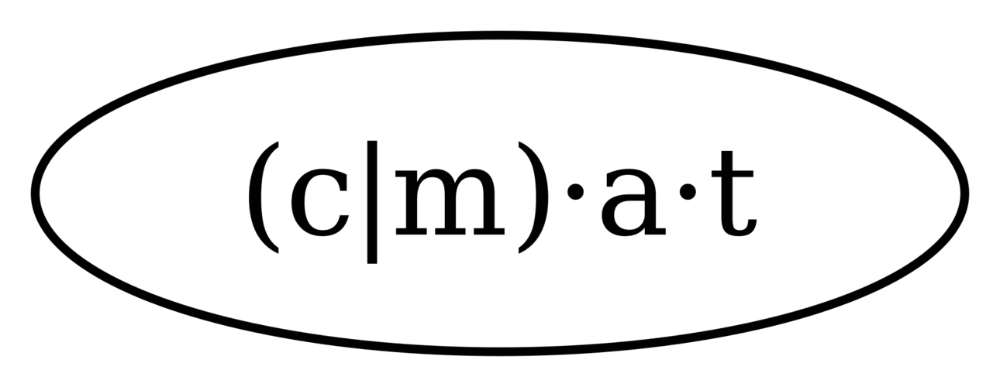
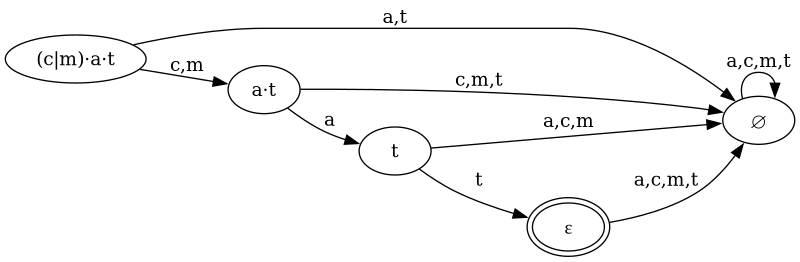

# Brzozowski Derivative

> Note: This is a fork of [c0stya/brzozowski](https://github.com/c0stya/brzozowski) which provides the original Python implementation. The Rust implementation has been added in [aalekhpatel07/brzozowski](https://github.com/aalekhpatel07/brzozowski) though. Visit the [crate documentation](https://docs.rs/brzozowski) for details about the Rust implementation.

*This code is provided for educational purposes. It is not efficient. But it illustrates the idea.*


[Brzozowski derivative](https://en.wikipedia.org/wiki/Brzozowski_derivative) is a less known technique to work with regular expressions. Normally, to match a string using regex we have to construct an [automaton](https://en.wikipedia.org/wiki/Nondeterministic_finite_automaton) and simulate it. With the regex derivative technique we can use a regular expression 'directly' without the automaton construction and simulation.

It has nothing to do with classical derivative in analysis. But the symbolic nature and chain rule application make it feel similar. For more details there is a paper ["Regular-expression derivative re-examined"](https://www.ccs.neu.edu/home/turon/re-deriv.pdf) by Scott Owens, John Reppy and Aaron Turon.

## Usage

This code implements only three operators. There are concatenation ($\cdot$), alternation ($\mid$), and Kleene star($*$).

Usage:

```bash
> python match.py <regex> <string>
```

E.g.

```bash
> python match.py '(c|b)at' 'cat'
(c|b)·a·t
c: a·t
a: t
t: ε
True
```

```bash
> python match.py '(c|b)at' 'car'
(c|b)·a·t
c: a·t
a: t
r: ∅
False
```

## Definition and rules

The derivative of a language $L \subset \Sigma*$ with respect to a string $u \in \Sigma*$ is a language $\partial_u L = \lbrace v \mid u \cdot v \in L \rbrace$.

For any characters *a* and *b* and for any regular expressions *r* and *s* we have following rules:

$$
\begin{align}
\partial_a \varepsilon &= \emptyset & \\
\partial_a a &= \epsilon & \\
\partial_a b &= \emptyset & \text{ for }(a \neq b) \\
\partial_a (r \cdot s) &= \partial_a r \cdot s \mid \nu(r) \cdot \partial_a s & \\
\partial_a (r \mid s) &= \partial_a r \mid \partial_a s & \\
\partial_a (r*) &= \partial_a r \cdot r* &
\end{align}
$$

where the function $\nu(r)$ checks if the language defined by regular expression contains an empty string ($\epsilon$). We call such regular expression *nullable*. The recursive definition of $\nu$ is:

$$
\begin{align}
\nu(\varepsilon) &= \varepsilon \\
\nu(\emptyset) &= \emptyset \\
\nu(a) &= \emptyset \\
\nu(r \cdot s) &= \nu(r) \cdot \nu(s) \\
\nu(r \mid s) &= \nu(r) \mid \nu(s) \\
\nu(r*) &= \varepsilon
\end{align}
$$

We need two rules with respect to strings to complete the rule set:

$$
\begin{align}
\partial_\varepsilon r &= r \\
\partial_{ua} &= \partial_{a} \partial_{u} r
\end{align}
$$

To find a match we have to check if the derivative of the regex $r$ with respect to string $u$ is *nullable*:

$$
\nu(\partial_{u} r) = \epsilon
$$

## Example

Let's check if word $cat$ matches the regexp $(c|b)at$. Obviously it is because the regex defines a language of just two strings $cat$ and $bat$. Anyway, let's do it formally.

$$
\partial_{cat}\left[(c \mid b)\cdot a \cdot t\right] = \partial_t\partial_a\partial_c\left[(c \mid b)\cdot a \cdot t\right]
$$

Let's take a derivative with respect of each character separately:

$$
\begin{align*}
\partial_c\left[(c \mid b)\cdot a \cdot t\right] &= \partial_c \left[c \mid b\right]\cdot a \cdot t \mid \nu(c \mid b) \cdot \partial_c [a \cdot t] & \text{ by } \cdot \text{-rule} \\
&= \partial_c \left[c \mid b\right]\cdot a \cdot t \mid \emptyset \cdot \partial_c [\cdot a \cdot t] &  \nu(c \mid b) = \nu(c) \mid \nu(b) = \emptyset \mid \emptyset = \emptyset \\
&= \partial_c \left[c \mid b\right]\cdot a \cdot t \mid \emptyset & r \cdot \emptyset = \emptyset \cdot r = \emptyset \text{ for any }r \\
&= \partial_c \left[c \mid b\right]\cdot a \cdot t & r \mid \emptyset = \emptyset \mid r = r \text{ for any }r \\
&= (\partial_c c \mid \partial_c b) \cdot a \cdot t & \text{ by } \mid \text{-rule} \\
&= (\epsilon \mid \emptyset) \cdot a \cdot t &  \\
&= \epsilon \cdot a \cdot t &  \\
&= a \cdot t &  \\
\partial_a[a \cdot t] &= \partial_a a \cdot t \mid \nu(a) \cdot \partial_a b   & \text{ by } \cdot \text{-rule} \\
&= \epsilon \cdot t \mid \emptyset & \\
&= t & \\
    \partial_t[t] &= \epsilon \\
\end{align*}
$$

So $\partial_{cat}\left[(c \mid b)\cdot a \cdot t\right] = \epsilon$ is *nullable* and the word $cat$ matches the regexp $(c \mid b)\cdot a \cdot t$.


## Matching algorithm

There are several ways to implement the derivatives. Some implementations follow a pure functional style. Here instead I use good old imperative style to avoid hidden logic.

The `match.py` invokes the following functions to find out if a string matches against a regex:

1. `augment`: extends the input regex with an explicit concatenation operator ($\cdot$): $c*at \to c * \cdot a \cdot t$.
2. `infix_to_postfix`: converts the augmented regex to a [postfix expression](https://en.wikipedia.org/wiki/Reverse_Polish_notation).
3. `postfix_to_tree`: converts the postfix expression to a [binary tree](https://en.wikipedia.org/wiki/Binary_tree) with tokens in leafs and operators in non-terminal nodes (update: current implementation uses plain python tuples to keep things simple).
4. `match`: invokes `deriv` for each token of the input string. Then evaluates the regex with `nullable`.
    - `deriv`: takes the derivative of the regex (now represented as a binary tree) with respect to a token of an input string. We modify the binary tree *inplace*. For some operators we have to clone a branch of the tree with the trivial recursive function `clone`.
    - `_sort`: sort the alternations in the tree using [merge sort algorithm](https://en.wikipedia.org/wiki/Merge_sort).
    - `_norm`: simplifies expressions like $r | \varepsilon$ or $\emptyset \cdot r$.
    - `nullable`: checks if the resulting regex (binary tree) is nullable. If it is nullable then we found a match.


## DFA construction algorithm



If we want to match multiple strings against a regular expression it is too expensive to compute the gradients for each string. We can do better. Let's pre-compute the derivatives for any possible input string.

The classical way is to construct non-deterministic finite state automaton (NFA) and then convert it to DFA. With Brzozowski derivatives we can construct DFA directly.

Given the regex $r$:

```
Q <- r                  queue to keep unexplored states
D <- r                  hash table to store all found states
while Q is not empty
    r <- Q.pop()
    for any c in alphabet A:
        s = take derivative of r wrt c

        if s not in dictionary D, then
            Q.push(s)
```

The logic is implemented in the `construct_dfa.py` script. It includes code to construct [graphviz compatible](https://graphviz.org/) graph specification.

```bash
> python construct_dfa.py '(c|m)at'

digraph G {
	splines=true; rankdir=LR;
	"(c|m)·a·t";
	"(c|m)·a·t" -> "∅" [ label="a,t" ];
	"(c|m)·a·t" -> "a·t" [ label="c,m" ];
	"∅";
	"∅" -> "∅" [ label="a,c,m,t" ];
	"a·t";
	"a·t" -> "t" [ label="a" ];
	"a·t" -> "∅" [ label="c,m,t" ];
	"t";
	"t" -> "∅" [ label="a,c,m" ];
	"t" -> "ε" [ label="t" ];
	"ε" [peripheries=2];
	"ε" -> "∅" [ label="a,c,m,t" ];
}
```

The way to render it using [graphviz command line library](https://graphviz.org/doc/info/command.html):

```bash
> python construct_dfa.py '(c|m)at' | dot -Tpng > dfa.png
```




## Why do we need it

1. It is fun
2. Using this technique we can construct a very efficient automaton close to what is called [minimal DFA](https://en.wikipedia.org/wiki/DFA_minimization). There are some considerations though but in some cases such construction can be very handy.

## TODO

1. Extend the derivative theory section
2. ~~Add the [DFA](https://en.wikipedia.org/wiki/Deterministic_finite_automaton) construction code~~
3. Explain regex normalization techniques
